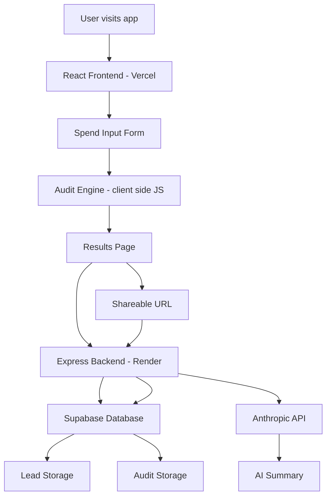

# Architecture

## System Diagram

## Data Flow

1. User fills in the spend input form on the React frontend
2. Form state is saved to localStorage on every change
3. User clicks Run My Audit
4. The audit engine runs entirely on the client side — no API call needed
5. Results are displayed instantly on screen
6. In parallel, three API calls go to the Express backend:
   - POST /api/summary — sends audit data to Anthropic API, returns 100-word summary
   - POST /api/audits — saves audit to Supabase, returns unique share ID
   - POST /api/leads — saves email + audit data to Supabase when user submits email
7. Share URL is constructed from the share ID and displayed to the user

## Why This Stack

**React + Vite** — Fast development, hot module replacement, familiar to me.
No SSR needed since all audit logic runs client-side.

**Express + Node.js** — Simple, familiar, great for building REST APIs quickly.
Handles Anthropic API calls server-side so the API key is never exposed.

**Supabase** — Free Postgres database with a simple REST API.
No complex ORM needed — raw queries are easy to reason about.

**Vercel** — Zero config deployment for React apps. Automatic HTTPS.

**Render** — Simple Node.js hosting with free tier. Environment variables easy to manage.

**Anthropic API** — Claude Haiku is fast and cheap for 100-word summaries.
Fallback to templated summary if API fails.

## What I Would Change at 10k Audits/Day

1. **Add a Redis cache** — Cache Anthropic API responses for similar audit profiles
   to reduce API costs and latency.

2. **Move audit engine to the backend** — Currently runs client-side which is fine
   for low traffic, but server-side gives better control and analytics.

3. **Add a queue for API calls** — Use Bull or similar to handle Anthropic API
   rate limits gracefully at scale.

4. **Add indexes to Supabase** — Index the share_id and created_at columns
   for faster lookups as the audits table grows.

5. **Upgrade Render to a paid plan** — Free tier sleeps after inactivity,
   causing cold start delays. Paid plan keeps it always-on.

6. **Add CDN for frontend** — Vercel already handles this well, but a custom
   domain with proper caching headers would improve global performance.